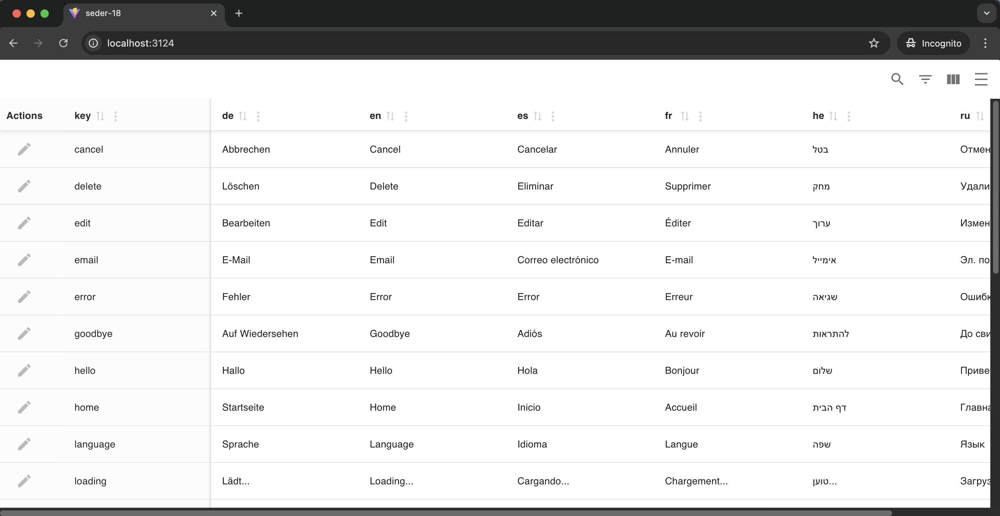

# i18n-seder

A lightweight, zero‑config translation management UI for developers working with JSON/i18n files.

i18n-seder lets you browse, search, edit, and save your translation files through a clean web interface — directly inside your project.

## 🚀 Features

📝 Edit translations via browser UI (no more editing huge JSON files manually)

🔍 Search across all languages

🌍 Multi-language table view — each key shown side‑by‑side in all languages

💾 Auto‑save back into your project’s JSON files

📂 Supports multiple files & directories

🔧 CLI tool — run it from your project with zero setup

## 📸 Screenshot


## 📦 Installation

Install globally or locally:

```bash
npm install i18n-seder --save-dev
```

## 🛠 Usage

Add a script to your project's package.json:

```json
{
  "scripts": {
    "my-i18n-seder-script": "seder ./path/to/translations"
  }
}
```

Then run:

```bash
npm run my-i18n-seder-script
```

This will:

Start a local Express server

Open your browser automatically

Display all languages + keys in an editable table

Save changes directly back into your translation JSON files

### 📁 Folder Structure

You can pass any folder containing translation JSON files.

Example:

locales/
  en.json
  he.json
  fr.json
  es.json

i18n-seder will detect them automatically.

### ⚙️ CLI

Basic usage:

seder <path-to-translation-folder>

Examples:

seder ./locales
seder ./src/i18n
seder ../shared/translations

### 🧩 How It Works

Reads all JSON translation files

Combines all keys into a single structured dataset

Displays them as a grid in the browser

When you edit a value → updates only that file

No build process, no watchers, no special config.

## 🛤 Roadmap

✔ Table editor

⏳ Add new keys from UI

⏳ Export/import CSV


## 🤝 Contributing

Pull requests are welcome! If you have ideas, feel free to open an issue.

## ⭐ Support

If you like this tool — please leave a star on GitHub 🙏
(It really helps this project grow.)

## 📄 License

MIT License.

